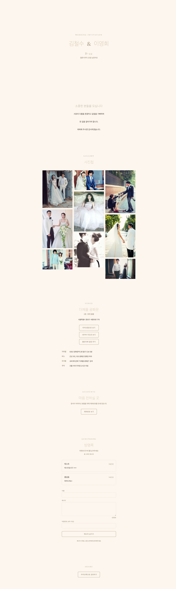
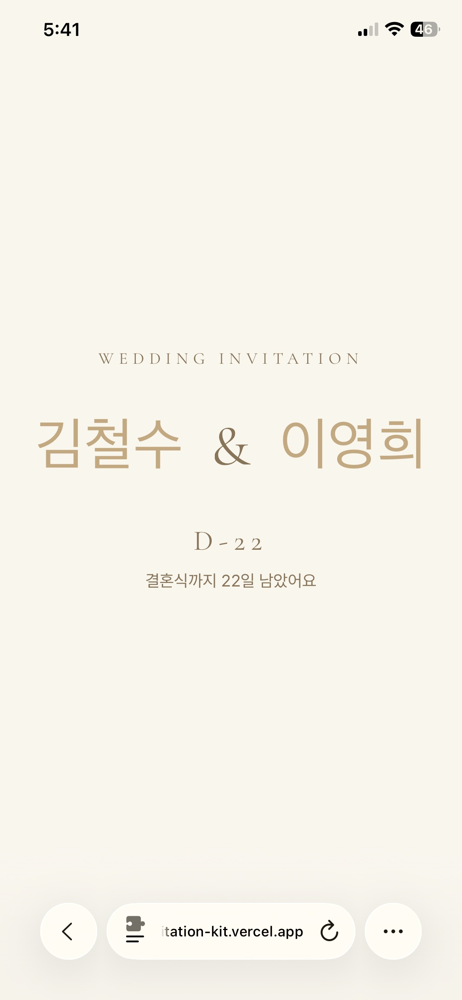
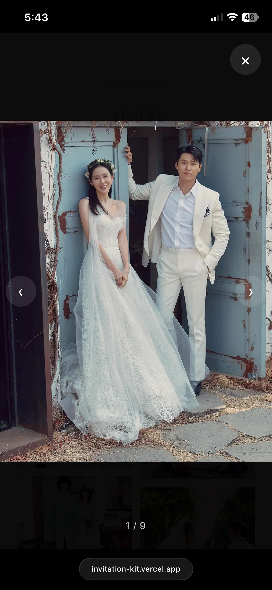
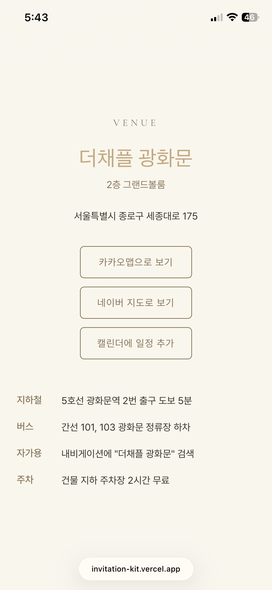
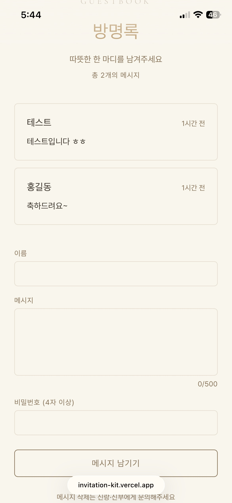
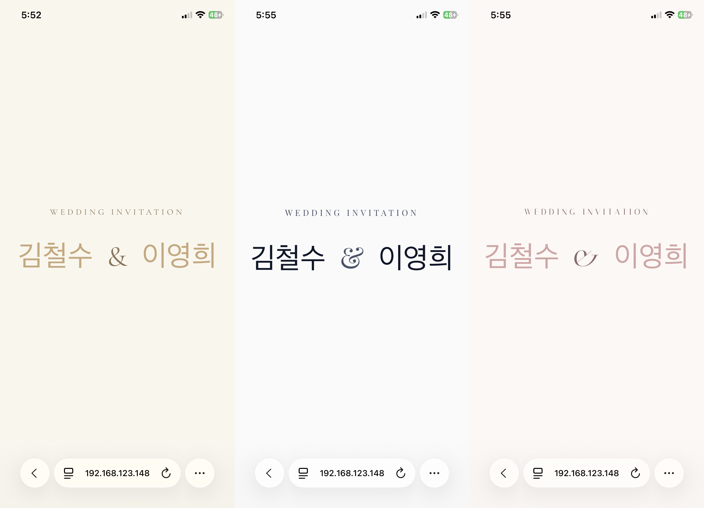

<div align="center">

# 💌 invitation-kit

**A config-driven open-source mobile wedding invitation template, optimized for Korean weddings**

Edit one config file, deploy in 5 minutes.

[Demo](#-demo) · [Quick Start](#-quick-start-in-5-minutes) · [Guides](#-guides) · [Features](#-features)

[](./LICENSE)
[](https://vercel.com/new)

**English** · [한국어](./README.md)

</div>

---

## ✨ Why invitation-kit?

- 🎯 **One file to edit** — Change `invitation.config.ts` and the whole invitation updates
- 🇰🇷 **Built for Korean weddings** — KakaoTalk share cards (KakaoTalk is Korea's dominant messenger), Kakao/Naver Map deeplinks (Naver Map is Korea's primary navigation app), both-side parent attribution, one-tap bank-account copy (Korean weddings give cash gifts at the door — guests need fast account access), and a guestbook
- 🎨 **Multi-theme (Classic · Modern · Floral)** — flip one `theme` value to swap palette, fonts, and radius. Adding a 4th theme is four file edits
- 💰 **Free forever** — ₩0/month on Vercel Hobby + Firebase Spark free tiers
- 🚫 **No ads, no watermarks** — It's your invitation
- 📱 **Mobile Safari first** — iOS 26 regressions found during builds are codified as permanent rules (see the "Animation rules" / "애니메이션 사용 규칙" section in `CLAUDE.md`)

---

## 🎬 Demo

[**Live demo — invitation-kit.vercel.app**](https://invitation-kit.vercel.app) — A fictional couple, "김철수 ♥ 이영희". Gallery, guestbook, KakaoTalk share, and Google Calendar are all functional.

### Desktop



### Mobile

|                                                          Home                                                          |                                               Gallery lightbox                                                |                                                              Venue (maps · calendar)                                                              |                                                    Guestbook                                                     |
| :--------------------------------------------------------------------------------------------------------------------: | :-----------------------------------------------------------------------------------------------------------: | :-----------------------------------------------------------------------------------------------------------------------------------------------: | :--------------------------------------------------------------------------------------------------------------: |
|  |  |  |  |

### Multi-theme

Flip one value: `theme: "classic" | "modern" | "floral"` (zero component changes — see the [Theme Guide](./docs/theme-guide.md)):



---

## 🚀 Quick Start in 5 Minutes

### 1. Fork & Clone

Click **Fork** at the top-right, then:

```bash
git clone https://github.com/YOUR_USERNAME/invitation-kit.git
cd invitation-kit
npm install
```

### 2. Edit the config

Open `invitation.config.ts` and fill in your details. At minimum update `meta`, `theme`, `groom`, `bride`, `date`, `venue`, and `share`.

```ts
export const config: InvitationConfig = {
  meta: {
    title: "Bride ♥ Groom — You're invited!",
    description: "May 17, 2026 — please join us as we begin our life together.",
    siteUrl: "https://your-project.vercel.app", // replace after deploy
  },
  theme: "classic", // "classic" | "modern" | "floral"
  groom: {
    name: "Groom",
    order: "Eldest son",
    father: "Father",
    mother: "Mother",
  },
  bride: {
    name: "Bride",
    order: "Eldest daughter",
    father: "Father",
    mother: "Mother",
  },
  date: "2026-05-17T12:00:00+09:00",
  venue: {
    name: "Venue name",
    address: "Seoul, ...",
    coords: { lat: 37.5, lng: 127.0 },
  },
  // ... full field reference: docs/config-guide.md
};
```

> Every field, plus operational variants (how to obtain coords, single-parent attribution, iOS autoplay, CLS prevention) lives in the [Config Guide](./docs/config-guide.md).

### 3. Deploy to Vercel

Push to GitHub, then import the repo on https://vercel.com/new → `Deploy`. A `your-project.vercel.app` URL is issued in 1–2 minutes.

Plug that domain into `meta.siteUrl` and `share.thumbnailUrl` in `invitation.config.ts`, then push again. These values become the link targets of the Kakao share card.

### 4. (Optional) KakaoTalk sharing — Kakao Developers console

Skip this section if you don't need KakaoTalk sharing — the share button automatically falls back to URL-copy.

Create an app at https://developers.kakao.com/console/app, then register your Vercel domain in **both** of these fields:

- `[App] > Platform Keys > JavaScript Key > JavaScript SDK Domain` — allows `Kakao.init()`
- `[App] > Product Link Management > Web Domain` — validates the `link.webUrl` host inside the share card

If you also enable the "Open in Map" button inside the share card, **add `https://map.kakao.com` to the Web Domain field as well**. Unregistered domains get silently stripped to your console default.

Copy the **JavaScript Key** from the `[App Keys]` page and add it to Vercel → Project Settings → Environment Variables as `NEXT_PUBLIC_KAKAO_APP_KEY` (check all three scopes: Production · Preview · Development), then **Redeploy** from the Deployments tab. `NEXT_PUBLIC_*` vars are inlined at build time, so a fresh build is required.

> ⚠️ **End-to-end Kakao share validation only works on a live Vercel domain with a real Kakao-installed device.** On localhost, LAN IPs, and Vercel previews, Kakao policy replaces the card link host with the console default. The full step-by-step walkthrough is in the [API Keys Guide](./docs/api-keys.md) (in Korean) and [`.claude/rules/kakao-sdk.md`](./.claude/rules/kakao-sdk.md).

### 5. (Optional) Guestbook — Firebase setup

Skip this section if you don't need a guestbook — set `guestbook.enabled = false` in `invitation.config.ts`.

When you create a project in [Firebase Console](https://console.firebase.google.com), get **these four things right**:

- **Standard edition** (not Enterprise — costs money and ships different features)
- Location **`asia-northeast3` (Seoul)** — picked once, can never be changed
- **"Start in production mode"** (not test mode — test mode expires in 30 days and lets anyone write meanwhile)
- When registering the web app, **uncheck "Also set up Firebase Hosting for this app"** (we use Vercel — Hosting would conflict)

Copy the 6 fields from `firebaseConfig` into Vercel Environment Variables as `NEXT_PUBLIC_FIREBASE_*` (all 6 keys, check Production · Preview), **Redeploy**, and paste the contents of [`firestore.rules`](./firestore.rules) into the "Rules" tab in the Firestore console.

> ⚠️ **Filling only `.env.local` and skipping Vercel registration = dev works but production fails.** `NEXT_PUBLIC_*` vars are inlined at build time — if Vercel doesn't have them, the SDK ships with `undefined` values and crashes with `auth/invalid-api-key`. Step-by-step screens and the top 5 mistakes are in the [API Keys Guide](./docs/api-keys.md) (in Korean).

🎉 **Your invitation is live.**

---

## 📦 Features

### Currently shipped (v0.2.0)

- 🏷 **Main hero** — groom & bride names, wedding date, auto-computed D-day badge
- ✉️ **Greeting section** — paragraphs from config, animated with CSS fade-in
- 📸 **Photo gallery + lightbox** — CSS columns masonry, prev/next buttons, ArrowLeft/Right keys, touch swipe (100px threshold), backdrop tap, Escape, wrap-around. Optimized via `next/image`
- 📍 **Venue** — address + Kakao/Naver Map deeplink buttons + **Add-to-Google-Calendar** button + transit info (subway / bus / car / parking)
- 💰 **Bank-account copy** — segmented toggle for groom/bride sides + accordion + hyphen-stripped copy (some Korean banking apps reject hyphens) + optional KakaoPay/Toss deeplinks
- ✍️ **Guestbook** — Firebase Firestore + bcryptjs password hashing (salt 10) + profanity filter (574 entries from `badwords-ko` + 10 self-curated consonant-variant entries). Loading / ready / error / empty states + optimistic prepend. Self-delete via password match (ADR 007 C')
- 📝 **RSVP** — attendance form: name, yes/no, groom/bride side, companions, optional message. Auto-disables after `config.rsvp.deadline`. Responses go to a Firestore `rsvp` collection with `read: false` (only the host views via Firebase Console). Design rationale in ADR 008
- 🎵 **Background music (optional)** — floating top-right toggle. 300ms fade-in/out, loops, no autoplay attempt (respects iOS Safari silent mode). Audio file is not shipped due to OSS licensing — bring your own (CC0 recommended) under `public/audio/` and set `config.music.enabled = true`
- 🛡️ **App Check (optional)** — Firebase reCAPTCHA v3 integration. Spam protection for guestbook & RSVP. Auto-enabled when `NEXT_PUBLIC_RECAPTCHA_SITE_KEY` is present, gracefully skipped otherwise. Enforcement is toggled in Firebase Console (monitor → enforce). See ADR 009
- 💬 **KakaoTalk share** — Kakao SDK v2.8.1 `Kakao.Share.sendDefault` with the feed template. Falls back to URL clipboard copy when the SDK isn't ready (in-app webviews, desktop, etc.)
- 🚨 **In-app webview banner** — detects KakaoTalk / Instagram / Facebook / Naver / Line webviews and prompts users to open in an external browser. `sessionStorage`-based dismiss
- 🎨 **Multi-theme (Classic · Modern · Floral)** — `:root[data-theme]` + Tailwind v4 `@theme` CSS variable overrides. Theme switching requires zero component changes
- 🌐 **OG meta tags** — preview thumbnails for KakaoTalk / iMessage / Twitter (800×400 `public/images/og.jpg`)

### v1.0.0 targets (Week 10)

- Lighthouse 90+ across mobile Safari · Android Chrome · in-app webviews (4-environment matrix)
- Demo site (fictional couple) + README demo link + screenshots / GIFs
- `v1.0.0` tag + GitHub Release

### v1.1+ roadmap

See [`docs/00-roadmap.md`](./docs/00-roadmap.md#-v11-마일스톤) for the full prioritized list. Shipped: OG optimization ✅ · text-primary contrast ✅ · guestbook self-delete (C' path) ✅ · RSVP ✅. Open: i18n · App Check · Pretendard dynamic-subset · server-mediated self-delete (B path) · BGM · Apple Calendar.

> Full change history: [CHANGELOG.md](./CHANGELOG.md).

---

## 📖 Environment variables

Copy `.env.example` to `.env.local` and fill it in. **Skip the 6 Firebase keys if you don't use the guestbook** — Kakao-only setups need a single key.

```env
# Required for KakaoTalk share. If empty, the share button falls back to URL-copy.
NEXT_PUBLIC_KAKAO_APP_KEY=

# Required for the guestbook (Firebase Firestore). If left empty, set guestbook.enabled = false.
NEXT_PUBLIC_FIREBASE_API_KEY=
NEXT_PUBLIC_FIREBASE_AUTH_DOMAIN=
NEXT_PUBLIC_FIREBASE_PROJECT_ID=
NEXT_PUBLIC_FIREBASE_STORAGE_BUCKET=
NEXT_PUBLIC_FIREBASE_MESSAGING_SENDER_ID=
NEXT_PUBLIC_FIREBASE_APP_ID=
```

> ⚠️ **Local `.env.local` + Vercel Environment Variables (Production · Preview checked) + a redeploy is one bundle.** Forgetting Vercel registration is the #1 mistake — dev works, prod fails. The full walkthrough is in the [API Keys Guide](./docs/api-keys.md) (in Korean).

---

## 📚 Guides

User-facing guides written for non-developers as well — currently in Korean.

- **[API Keys Guide](./docs/api-keys.md)** — Kakao + Firebase key issuance, the two Kakao domain fields, Firebase Console essentials, Vercel Environment Variables + redeploy, top 5 mistakes
- **[Config Guide](./docs/config-guide.md)** — every top-level key in `invitation.config.ts` plus operational variants (obtaining coords, single-parent attribution, both-empty parent arrays, iOS autoplay, CLS prevention, `share.buttons` truth table)
- **[Theme Guide](./docs/theme-guide.md)** — 9-token catalog, a worked 5-step walkthrough for adding a 4th theme (`vintage` scenario), a Modern worked example (intent + 7 changed tokens + actual code), notes on Floral, design decision guidance, and 5 gotchas

---

## 🗂 Project Structure

```
invitation-kit/
├── app/                       # Next.js 16 App Router
│   ├── page.tsx              # main invitation rail (sections + conditional guestbook mount)
│   ├── layout.tsx            # meta tags, fonts (×4), <html data-theme={config.theme}>
│   ├── globals.css           # Tailwind v4 @theme tokens + Modern · Floral overrides
│   └── fonts/                # Pretendard Variable (self-hosted)
├── components/
│   ├── sections/             # Main · Greeting · Gallery · Venue · Accounts · Guestbook · Share
│   │   └── guestbook/        # GuestbookForm · GuestbookList (split out of orchestrator)
│   ├── DDayBadge.tsx         # D-day badge (Client)
│   └── InAppBrowserNotice.tsx # in-app webview banner (Client)
├── lib/
│   ├── firebase.ts           # Firestore db singleton (HMR-safe)
│   ├── kakao.ts              # Kakao Share SDK wrapper
│   ├── map.ts                # Kakao / Naver Map deeplinks
│   ├── calendar.ts           # Google Calendar URL pure function
│   ├── clipboard.ts          # clipboard helpers
│   ├── hash.ts               # bcryptjs password hashing
│   ├── profanity.ts          # profanity filter (badwords-ko + consonant variants)
│   ├── userAgent.ts          # in-app webview detection
│   ├── date.ts               # D-day computation
│   └── hooks.ts              # useIsClient (useSyncExternalStore)
├── public/images/            # og.jpg + gallery/sample-01~09.jpg
├── invitation.config.ts       # ✨ the only file you need to edit
├── .env.example              # 1 Kakao key + 6 Firebase keys (sample)
├── firestore.rules           # guestbook security rules
├── firebase.json             # Firestore Emulator config
├── .claude/rules/            # area-specific working rules (kakao-sdk.md · firebase.md)
└── docs/
    ├── api-keys.md           # API Keys Guide
    ├── config-guide.md       # Config Guide
    ├── theme-guide.md        # Theme Guide
    ├── adr/                  # ADRs (currently 6)
    └── retrospective/        # weekly retrospectives
```

---

## 🤝 Contributing

Issues, PRs, and theme submissions are all welcome. Full flow, in-scope vs out-of-scope areas, and the standard quality-gate sequence: [`CONTRIBUTING.md`](./CONTRIBUTING.md) (in Korean — commands and checklists are language-neutral).

- Report bugs: [Issues](../../issues)
- Suggest features / discussions: [Discussions](../../discussions)
- New theme PRs: follow the 5-step flow in the [Theme Guide](./docs/theme-guide.md)
- For PRs, see the [PR template](./.github/PULL_REQUEST_TEMPLATE.md) checklist (mobile Safari verification, personal-data check)

---

## 📄 License

MIT © 2026 — Fork freely for your own or your friends' weddings 💍

---

## 🙏 Inspiration

- [wzulfikar/nextjs-wedding-invite](https://github.com/wzulfikar/nextjs-wedding-invite)
- [immutable.wedding](https://immutable.wedding)
- And many Korean developers' "I built my own wedding site" blog posts

This project started from a wish for an open-source template that respects Korean wedding culture.
