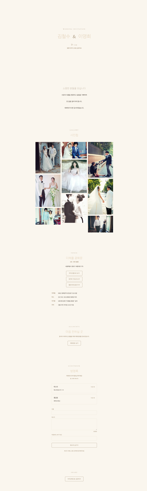

# 청첩장을 오픈소스로 만들기 — invitation-kit v1.0 12주 회고

> Next.js 16 · Tailwind v4 · Firebase 로 한국 결혼식에 최적화된 모바일 청첩장 템플릿을 만든 12주 호흡 회고. 코드 자체보다는 의사결정과 함정 위주.

- **GitHub**: https://github.com/kyongskim/invitation-kit
- **Live demo**: https://invitation-kit.vercel.app — 가상 커플 `김철수 ♥ 이영희`
- **현재 버전**: v1.0.0 (2026-04-25 릴리스)

---

## 왜 만들었나

결혼 준비를 시작하면서 모바일 청첩장 시장을 들여다 봤다. 두 가지가 이상했다.

- **해외 OSS** 는 config 구조도 깔끔하고 코드 품질도 좋은데 한국 결혼식 기능이 없다. 카카오톡 공유 카드, 카카오·네이버 지도 딥링크, 한국식 축의금 계좌 표기, 양가 부모 표기.
- **국내 OSS** 는 한국 기능은 있지만 거의 다 본인 결혼식용 하드코딩이라 fork 해서 쓰려면 수십 곳을 수정해야 한다. 진짜 의미의 "재사용 가능한 템플릿" 이 부족했다.

> 두 장점을 결합하면 어떨까. **Config 파일 하나만 수정해서 5분 안에 배포되는 한국형 OSS 청첩장 템플릿.**

이 한 줄을 12주 동안 끌고 갔다.

---

## 무엇을 만들었나

`invitation.config.ts` 한 파일만 수정하면 신랑·신부 이름부터 갤러리·계좌·지도·캘린더·방명록까지 전부 바뀐다. 컴포넌트 코드는 건드릴 필요가 없다.



`theme: "modern"` 한 값만 바꾸면 전체 분위기가 이렇게 바뀐다 — 컴포넌트 코드 수정은 0 건:


- **다중 테마 3 종** (Classic · Modern · Floral) — `theme: "classic"` 한 값만 바꾸면 팔레트·폰트·radius 가 전부 전환
- **한국 기능** — 카카오 공유 카드 + 카카오/네이버 지도 + 한국식 계좌 복사 + 양가 부모 + 구글 캘린더
- **방명록** — Firebase Firestore + bcryptjs + 욕설 필터 (badwords-ko + 자체 자음 변형 보강)
- **모바일 Safari 1순위 검증** — iOS 26 에서 발견한 회귀들을 규칙 파일로 영구화

라이브 데모 (위 링크) 자체가 가상 커플의 OSS 공식 데모로 작동한다.

---

## 12주의 분기점

### 1-2주차 — 셋업: 학습 데이터를 의심하기

`create-next-app@latest` 를 돌리니 Next.js **16.2.4** 가 깔렸다. 계획은 15 였는데 그 사이 16 이 나와 있었다. Next.js 16 은 `cookies()` · `headers()` · `params` 가 모두 async 가 되고, 미들웨어 파일명이 `proxy.ts` 로 바뀌고, `<Image quality>` 의 허용 목록 정책이 바뀌는 등 **학습 데이터(2025년 이전) 와 어긋나는 부분이 꽤 많은 메이저 업데이트**였다.

ADR 003 으로 "16 유지, 학습 데이터의 API 를 우선 의심" 정책을 고정하고 CLAUDE.md 에 체크리스트를 박아뒀다. 12주 내내 이 결정이 유효했다.

### 3-4주차 — 모바일 Safari 와의 첫 충돌

Main 히어로에 framer-motion 을 붙였더니 iPhone 에서 **흰 화면**. 디버깅 결과 `motion.*` 의 `initial` prop 이 SSR HTML 에 인라인 스타일 (`opacity: 0`, `transform`) 을 박는데, iOS Safari 26 에서 hydration 후 풀리지 않는 회귀가 있었다. Greeting 섹션에서 `whileInView` 로 같은 것을 두 번째로 재현 (4주차).

해결: **on-mount 페이드는 CSS keyframe 으로, framer-motion 은 JS-only 영역에만** 사용하기로 분리. CLAUDE.md 의 영구 규칙으로 박았다.

```css
/* app/globals.css */
@theme {
  --animate-fade-in-up: fade-in-up 0.6s ease-out both;
}

@keyframes fade-in-up {
  from {
    opacity: 0;
    transform: translateY(16px);
  }
  to {
    opacity: 1;
    transform: translateY(0);
  }
}

@media (prefers-reduced-motion: reduce) {
  @keyframes fade-in-up {
    from {
      opacity: 0;
      transform: none;
    }
    to {
      opacity: 1;
      transform: none;
    }
  }
}
```

CSS keyframe 이 SSR-safe 한 이유: 브라우저가 JS 와 무관하게 keyframe 을 무조건 실행하므로 JS 가 안 돌아도 끝까지 진행. framer-motion 은 JS animate 가 인라인 invisible 을 풀어야 하는 모델이라 JS 가 어디선가 막히면 invisible 이 영구화된다.

### 5-6주차 — 카카오 도메인 2 필드 함정과 React 19 새 룰

**카카오 콘솔 도메인은 2 필드로 분리**돼 있다. 한 필드만 등록하면 SDK init 은 성공하고 `sendDefault` 도 카드를 보내지만, 카드 본문·버튼의 링크 호스트가 strip 돼서 PC 카톡엔 "모바일에서 확인해주세요" 가 뜨고 iPhone 에선 카드 탭이 무반응이 된다. 5주차 실기기에서 직접 재현하고 [`.claude/rules/kakao-sdk.md`](https://github.com/kyongskim/invitation-kit/blob/main/.claude/rules/kakao-sdk.md) 에 표로 박았다.

| 필드                      | 검증 대상                                                   |
| ------------------------- | ----------------------------------------------------------- |
| **JavaScript SDK 도메인** | `Kakao.init()` 호출 허용 (origin)                           |
| **웹 도메인**             | `content.link.webUrl` · `buttons[].link.webUrl` 호스트 검증 |

심지어 `share.buttons.map` (지도 버튼) 의 `https://map.kakao.com` 도 **우리 앱의 웹 도메인에 별도 등록**해야 한다. 카카오 자사 도메인이라도 "다른 앱 관점에선 외부 도메인" 이라는 게 결정적.

같은 시기 **React 19 가 `react-hooks/set-state-in-effect` 룰을 추가**했다. `useEffect` 안에서 `setState` 를 cascading render 로 경고하는 룰. D-day 배지가 첫 희생자였고 `useSyncExternalStore` 기반 훅으로 리팩터:

```ts
// lib/hooks.ts
import { useSyncExternalStore } from "react";

const subscribe = () => () => {};
const getClientSnapshot = () => true;
const getServerSnapshot = () => false;

/**
 * SSR 단계에서는 false, 클라이언트 hydration 이후엔 true.
 * useEffect + setState 토글 패턴 대비:
 * - SSR HTML 과 첫 클라이언트 렌더가 일치 (hydration mismatch 없음)
 * - useEffect 1 회 실행 비용 절약
 * - React 19 `react-hooks/set-state-in-effect` 룰과 충돌하지 않음
 */
export function useIsClient(): boolean {
  return useSyncExternalStore(subscribe, getClientSnapshot, getServerSnapshot);
}
```

이 패턴이 5주차→6주차→8주차 동안 세 번 재발한 후 (`firebase.md` 의 톤도 "주의" → "절대 금지" 로 격상) 마침내 lock-in 됐다.

### 7주차 — 컴포넌트 코드 0 건 수정으로 다중 테마

가장 만족스러웠던 한 주. **Tailwind v4 의 `@theme` + `:root[data-theme]` CSS 변수 cascade override** 로 다중 테마를 구현하면, 컴포넌트 안의 `bg-primary` · `rounded-sm` 같은 토큰 유틸이 **자동으로 테마 전환에 반응한다.** 컴포넌트 수정이 0 건.

```css
/* app/globals.css — Classic 기본값 */
@theme {
  --color-primary: #c9a87c;
  --color-secondary: #6b5942;
  --font-serif: var(--font-cormorant);
  --radius-sm: 0.375rem;
}

:root[data-theme="modern"] {
  --color-primary: #0f172a;
  --color-secondary: #475569;
  --font-serif: var(--font-playfair);
  --radius-sm: 0;
}

:root[data-theme="floral"] {
  --color-primary: #d4a5a5;
  --color-secondary: #6b4f4f;
  --font-serif: var(--font-italiana);
  --radius-sm: 0.625rem;
}
```

```tsx
// app/layout.tsx — 한 줄로 테마 적용
<html data-theme={config.theme}>
```

ADR 005 에 거부된 대안 5 종 (A. 테마별 컴포넌트 fork / B. props 로 토큰 전달 / C. CSS Modules · ...) 과 채택 근거를 박았다. **`@theme inline` modifier 를 쓰면 토큰 참조가 CSS 에 박혀 런타임 override 가 무효화된다는 함정**도 같이 기록.

8주차에 Floral 테마를 추가할 때 컴포넌트는 0 줄, CSS 8 줄, config union 1 줄 수정으로 끝났다. 이 경험이 `docs/theme-guide.md` (4번째 테마 추가 worked example) 의 자료가 됐다.

### 8주차 — 방명록: 비밀번호를 받지만 검증은 안 한다

방명록은 Firebase Auth 를 안 쓰기로 했다. 청첩장 하객에게 OAuth 로그인을 강요하는 건 마찰이 너무 크다. 그러면 **"본인 글만 삭제" 를 어떻게 보장하나?** 3 후보를 비교했다.

- **A. Cloud Function 프록시** — 안전하지만 Cloud Functions 가 `firebase.md` 스코프 밖 (Blaze 플랜 트리거 가능 → 무료 운영 약속 깨짐)
- **B. Soft delete** — `deletedAt` 필드 update 만 허용. 그러나 **"본인만 tombstone 가능" 을 Firestore 보안 규칙으로 증명할 수 없다.** 누구나 임의 문서를 tombstone 할 수 있어 vandalism 가능. 거부
- **C. Delete 자체 금지 + 운영자 안내** — MVP 채택

```js
// firestore.rules
match /guestbook/{id} {
  allow read: if true;
  allow create: if /* 스키마 4 필드 + 길이·타입·serverTimestamp 검증 */;
  allow update: if false;
  allow delete: if false;  // C 경로 — 운영자는 Firebase Console 에서 수동 삭제
}
```

여기 솔직한 약점이 있었다. **8주차 시점엔 비밀번호 입력은 받지만 검증 경로가 없었다.** UI 가 약속한 것을 코드가 안 지키는, 약한 다크 패턴에 가까운 상태. 이건 12주차에 ADR 007 으로 closure — **클라이언트 bcrypt 검증 + `allow delete: if true;`** (C' 경로). 청첩장 도메인 위협 모델 약함을 전제로 한 트레이드오프이고, 진짜 안전한 서버 매개 (Vercel Route Handler + Admin SDK) 는 v1.1+ 재검토 트리거 (vandalism 사례 또는 작성자 풀 100명+) 충족 시 도입 예정. 다른 도메인 fork 시 부적합함은 firebase.md · ADR 007 · README 에 명시.

### 9-10주차 — 비개발자 가이드 + Performance 측정의 정직성

9주차는 "비개발자도 5분 배포" 약속의 본격 준비. `docs/api-keys.md` (카카오·Firebase 키 발급) · `docs/config-guide.md` (`invitation.config.ts` 11 키 전수) · `docs/theme-guide.md` (4번째 테마 추가 worked example) 가이드 3 종을 신규 작성. 작성 자체가 **코드 정합성 외부 검증으로 작동**했다.

10주차는 첫 Lighthouse 측정 사이클. 1차 가설 두 개 (Gallery `priority` · text-secondary 색) 를 측정해 보니 **둘 다 부정확**. 진단 audit detail (`network-requests`, `largest-contentful-paint-element`, `bootup-time`) 을 깊이 파고 나서야 진짜 원인을 찾았다. **`PretendardVariable.woff2` (2,059KB, 페이지 weight 의 80%).**

- variable → 3 weight Korean subset 784KB (62% 절감)
- LCP 15.1s → 5.1s (-10s)
- Performance 71 → 78 (모바일 simulate Slow 4G)

90+ 미달이지만 **사이클 자체는 closure**. 인위적 micro-optimization 이나 measurement gaming 으로 점수를 끌어올리지 않고, "78 + Pretendard dynamic-subset · firebase lazy import 같은 후속 후보를 v1.1+ 로" 정직하게 v1.0 release notes 에 기록했다.

이 결정의 배경이 있다. **점수 closure (90+ 도달) vs 사이클 closure (진단 → 수정 → 재측정 → 한계 발견 → 다음 후보 정리) 의 trade-off.** OSS 템플릿이 첫 인상으로 정직성을 잃으면 이후 기여자 신뢰가 뚫리는 게 더 큰 손실이라 봤다.

---

## 12주에서 배운 5 개

### 1. 회고의 "다음 주차로 넘기는 것" 명세는 **시작 시점의 가정**이다

10주차 우선 1번 ("README 영문 5주차 이후 동기화") 을 시작하면서 `git log 22e90ad..HEAD -- README.md` 를 돌렸더니 **한국어 README 도 변경 0** 이었다. 회고 작성 시점의 "영문이 한국어를 쫓아간다" 는 가정이 사실 위에 있지 않았던 것. 작업 직전 git history 같은 원자료 검증이 plan 단계의 일부여야 한다.

### 2. Performance 가설은 측정으로만 검증된다

코드만 보고 만든 정황 분석 (Gallery priority, text-secondary 색) 이 두 차례 부정확했다. **데이터부터, 가설은 출발점일 뿐.** 다만 1차 가설의 코드 의도 자체가 옳으면 (above-the-fold 아닌데 priority 두지 않음, secondary 4.5:1 보장 baseline) 효과 미미해도 보존 — fix-forward 가 아니라 forward-only.

### 3. 회고 = 스냅샷 + 후속 패치

9주차 회고 우선 5번 진단이 부정확했음을 9주차 작업 중 발견. 그러나 본문은 그대로 두고 `### 5번 9주차 fact-check` sub-bullet 으로 정정만 박았다. **retroactive rewrite 로 가설을 지우면 학습 가치 자체가 사라진다.** 회고는 그 시점의 스냅샷, 실제 작업이 정정해도 그 흔적이 남아야 다음 회고 작성 시 가설 검증 사이클이 보존된다.

### 4. quality gate 1 패스는 의식의 결과다

`rm -f .eslintcache && lint && typecheck && format:check && build`. 8주차 두 차례 · 9주차 두 차례 fix-forward (대부분 prettier `format:check` 누락) 후 표준 시퀀스를 CLAUDE.md 에 명시. 10주차 7 커밋 모두 1 패스. 매 커밋 prettier 가 markdown table padding 을 자동 정렬한다는 인지 + format → format:check 두 단계 워크플로의 누적 효과.

### 5. 사이클 closure vs 점수 closure

v1.0 의 정직성. "결과로 90+ 만들기" 보다 "사이클 완수 + 한계 정직 기록 + 다음 후보 정리" 를 closure 의 정의로 잡았다. 점수에 끌려가면 의미 없는 micro-optimization 으로 시간을 태우게 된다.

---

## 솔직한 약점

- **방명록 비밀번호 입력의 어색함** — 위 8주차 절. 12주차 또는 v1.1 에서 결정.
- **Lighthouse Performance 78 (90+ 미달)** — Pretendard dynamic-subset · firebase lazy import 가 v1.1 후보.
- **Lighthouse CLI 한계** — desktop preset 측정에서 LCP/TBT/TTI 가 일관되게 `score=null` 반환 (두 차례 재현). desktop 점수는 [pagespeed.web.dev](https://pagespeed.web.dev) 가 정확.
- **i18n 미지원** — v1.1+ 후보. 현재는 한국 결혼식 1순위 타깃에 집중.
- **외부 사용자 0 명** — 본 회고 시점이 v1.0 직후라 실수요 데이터 없음. 다음 호흡 (X 쓰레드 · OKKY · HN Show) 에서 측정 시작.

---

## 마무리

12주가 짧지는 않았지만 길지도 않았다. 단일 기여자 사이드 프로젝트로 v1.0 을 마감할 수 있었던 건 **Config-driven 절대 원칙 + 매 주차 회고 + ADR 의사결정 기록 + Progressive Disclosure 규칙 파일** 이라는 4 가지가 서로를 떠받쳤기 때문이다. 셋 중 하나만 빠져도 호흡이 길어지면 의도를 잃었을 것이다.

결혼식 청첩장이라는 도메인은 작아 보이지만 **모바일 Safari 회귀 · 카카오 도메인 2 필드 · React 19 새 룰 · Firebase 보안 규칙으로 본인 인증 증명 불가 · Performance 측정 가설의 부정확성** 같은 "단일 기여자가 자주 만나는 함정" 이 다 들어있는 프로젝트였다. fork 한 분이 같은 함정을 안 밟길 바라며 [`.claude/rules/`](https://github.com/kyongskim/invitation-kit/tree/main/.claude/rules) 와 [`docs/adr/`](https://github.com/kyongskim/invitation-kit/tree/main/docs/adr) 에 흔적을 박았다.

기여 환영합니다 — [CONTRIBUTING.md](https://github.com/kyongskim/invitation-kit/blob/main/CONTRIBUTING.md) 에 환영하는 기여 4 종과 환영 안 하는 기여 5 종을 솔직히 적어뒀습니다.

- **GitHub**: https://github.com/kyongskim/invitation-kit
- **Live demo**: https://invitation-kit.vercel.app
- **v1.0.0 Release**: https://github.com/kyongskim/invitation-kit/releases/tag/v1.0.0

---

_이 글은 [invitation-kit](https://github.com/kyongskim/invitation-kit) 의 12주차 호흡 중 11주차 공개·홍보 호흡의 첫 산출물입니다. X 쓰레드, Awesome Korean PR, Hacker News Show HN 으로 이어집니다._
